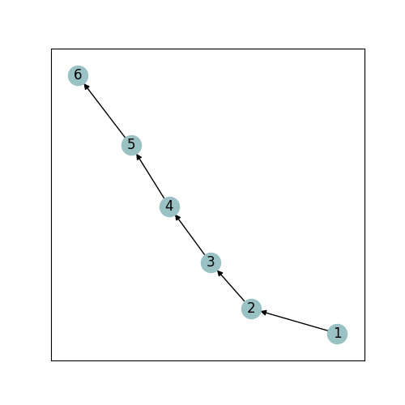
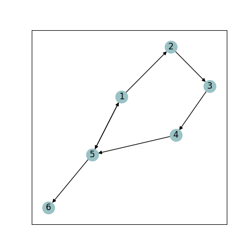
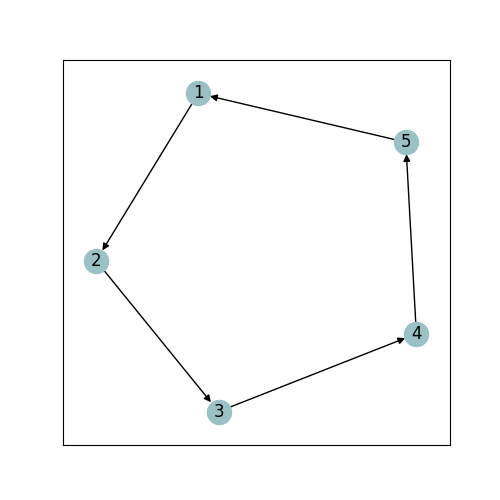
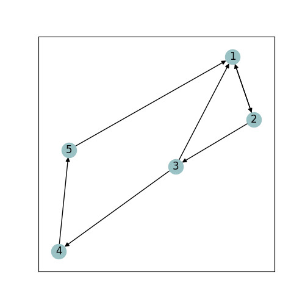
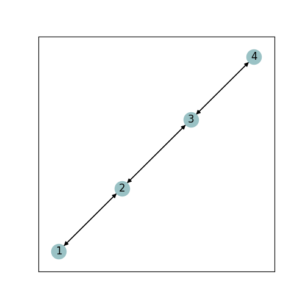
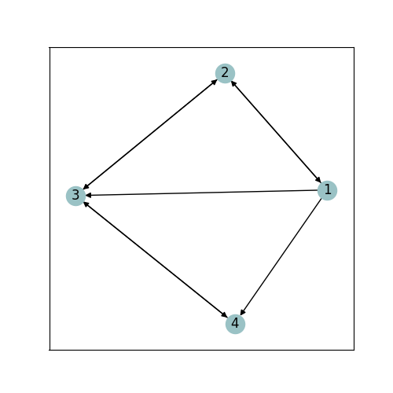
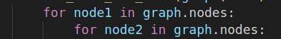
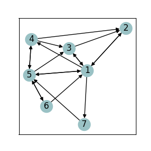
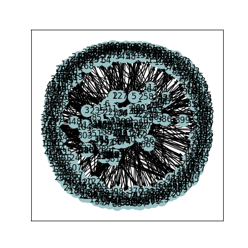
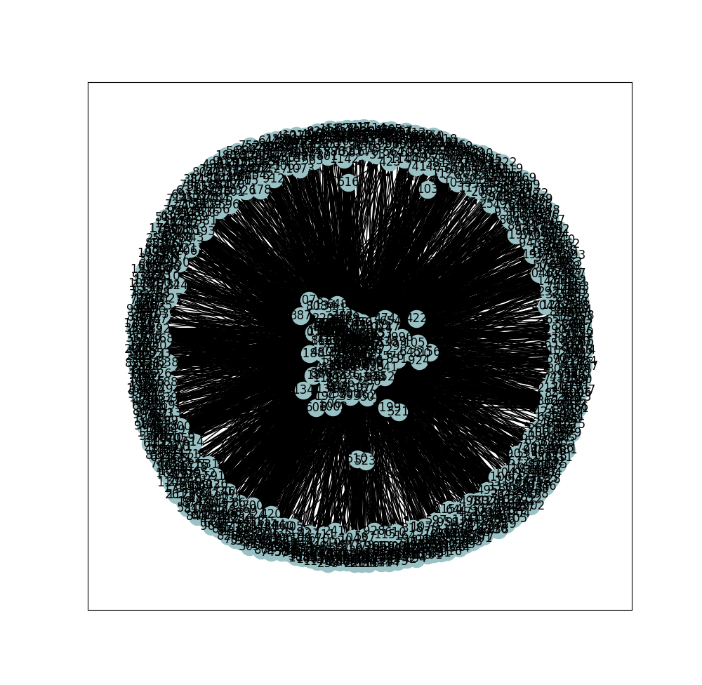

# Data Mining HW3 Report

:girl: P77111037 樊紹萱

## :one:  Implementation detail

:star: 解釋你是怎麼實作這三個演算法、三個演算法的原理（可比較相同或不同處）

### :high_brightness: 原理與實作方式

| Algorithm | 原理 | 實作方式 | 
| ---- | ---------- | ------ | 
| HITS | 透過計算該節點**被多少個節點指到**，以及該節點**指向多少個節點**，來計算該節點的權重 | :black_circle:  每一個 iteration 時，會先計算所有節點的 authority & hub   :small_red_triangle:  Authority = Sum(該節點所有的父節點的 Hub 值)   :small_red_triangle:  Hub = Sum(該節點所有的子節點的 Authority 值)  :black_circle: 接著進行標準化   :small_red_triangle:  Authority = 該節點未標準化前的authority / 未標準化前所有節點的Authority總和  :small_red_triangle:  Hub = 該節點未標準化前的Hub / 未標準化前所有節點的Hub總和 |
| PageRank | PageRank 是指網頁被看到的可能性，每個網頁都有個別的 PageRank，取決於網頁間連結關係 :bulb: 一個網站的 PageRank 值，來自於**加總所有連結到該網站的網站的PageRank 值除以本身的導出連結數** | :black_circle: 每一個 iteration 時，會先計算所有節點的 PageRank   :small_red_triangle: 先算該節點所有父節點的總和 (每個父節點的 PageRank/父節點的子節點總數)  :black_circle: 接著進行標準化  :small_red_triangle: PageRank = 該節點未標準化前的 PageRank / 未標準化前所有節點的PageRank總和|
| SimRank  | 假設用戶和物品在空間中形成了一張圖，如果兩個用戶相似，則與這兩個用戶相關聯的物品也類似；如果兩個物品類似，則與這兩個物品相關聯的用戶也類似 | :black_circle: 迭代每一對節點，分別計算個節點的SimRank，且更新並取代舊的SimRank的值  |

 
 
 

### :high_brightness: HITS & PageRank 比較

1. 相同:
    - 他們都利用 Web 圖的鏈接結構來決定頁面的相關性 
2. 相異

    | HITS | PageRank | 
    | ---- | -------- | 
    | 需**線上**計算 :point_right:  計算效率較**低**   (因與用戶輸入的查詢請求有高度的相關性，所以在接收到用戶請求時，需要即時的計算) | 可**離線**計算 |
    | 計算物件數量較**少** | 是**全局性演算法**，對所有互聯網頁面節點進行處理 |
    | 適合部署在**用戶端** | 適合部署在**伺服器端** |

### :high_brightness: PageRank & SimRank 比較

相異： PageRank只能得到某一個節點自己的權重，而SimRank卻可以得到兩兩之間的權重度量

## :two: Result analysis and discussion (iteration = 1)

:star: 包含投影片中的find a way: Find a way (e.g., add/delete some links) to increase hub, authority, and PageRank of Node 1 in first 3 graphs respectively. 對圖1到3的 node 1，試著增加或減少 links，或增加減少點的數量，使node 1在 hub/authority/PageRank三個值中「擇一」增加

以下分別進行 圖1到3的 node 1 分析

### :high_brightness: Graph1

原本的圖一： :point_down:

後來的圖一： :point_down:   :mag_right:讓 node 1 指到 node5 ，且讓 node5 也指回 node1

:pencil2: 解釋與比較

新的圖我把 **node 1 指到 node5 ，且讓 node5 也指回 node1**

node 1 :

- children: 2,5 （原本只有2)
- parent: 5  (原本沒有)
- Authority: 0.0 :point_right: 0.14286
- Hub: 0.2 :point_right: 0.333

| Grapgh | Result |
| ------- | ----- |
graph1 | Authority: [0.0 0.2 0.2 0.2 0.2 0.2]  Hub: [0.2  0.2 0.2 0.2 0.2 0.0] | 
graph1 - new | Authority: [0.14286 0.14286 0.14286 0.14286 0.28571 0.14286]   Hub: [0.333 0.111 0.111 0.222 0.222 0.0 ] | 

### :high_brightness: Graph2

原本的圖二： :point_down:

後來的圖二： :point_down:  (讓 node 2 & 3 都指到 node1)

:pencil2: 解釋與比較

:mag_right: 新的圖我把 **node 2 & 3 都指到 node1**

node 1 :

- children: 2 （沒更動)
- parent: 2,3,5  (原本只有5)
- Authority: 0.2 :point_right: 0.42857

| Grapgh | Result |
| ------- | ----- |
graph1 | Authority: [0.2 0.2 0.2 0.2 0.2]  Hub: [0.2  0.2 0.2 0.2 0.2 0.0] | 
graph2 - new | Authority: [0.42857 0.14286 0.14286 0.14286 0.14286]   Hub: [0.077 0.308 0.308 0.077 0.231 ] |

### :high_brightness: Graph3

原本的圖三： :point_down:

後來的圖三： :point_down:  (node1 多指到 3 & 4)

:pencil2: 解釋與比較

:mag_right: 新的圖我把 **node1 多指到 3 & 4**

node 1 :

- children: 2,3,4 （原本只有2)
- parent: 2  (沒更動)
- Hub: 0.2 :point_right: 0.389

| Grapgh | Result |
| ------- | ----- |
graph3 | Authority: [0.16667 0.33333 0.33333 0.16667]  Hub: [0.2  0.3 0.3 0.2 ] | 
graph3 - new | Authority: [0.125 0.25 0.375 0.25]   Hub: [0.389 0.222 0.222 0.167] |

## :three: :watch: Computation performance analysis

:star: 對 dataset 中的圖1到5，計時每張圖在三個演算法上的秒數。並試著解釋為什麼某些演算法或某些圖要跑特別久。

| Graph | HITS :watch:Time   **second** | PageRank :watch:Time   **second** | SimRank :watch:Time   **second** |
| --------- | ----- | -------------- | ----------- |
1 | 0.002520 | 0.001192 | 0.001477 |
2 | 0.003210 | 0.001221 | 0.001474 |
3 | 0.003011 | 0.001218 | 0.001154 |
4 | 0.002703 | 0.001078  | 0.001954 |
5 | 0.018052 | 0.008929 | :warning:11.646827 |

:pencil: Explanation

**graph_5.txt 用 SimRank 演算法的時候花費很久的時間**，我覺得應該是因為 SimRank 跑過的節點數量是其他的平方倍 (n * n) ，因為有兩個 for loop，如下 :point_down:

:bulb: 我後來又多跑了 graph6 (圖形又比 graph5複雜許多)，耗時如下： 

| Graph | HITS :watch:Time   **second** | PageRank :watch:Time   **second** | SimRank :watch:Time   **second** |
| --------- | ----- | -------------- | ----------- |
1 | 0.010403 | 0.005775 | :warning:467.249918 |

## :four: Discussion (iteration = 1)

### 效能

以第:three:上面那張比較圖為例，發現說在 iteration=1的時候，**在圖1~5最慢的都是 HITS 演算法**，**最快的幾乎都是 PageRank 演算法**。但在圖形越來越複雜的時候 (ex: graph 5)， 反而是 SimRank 最慢，而且慢許多
### 展示 graph 1~6 的圖 

:star:（我用 `networkx.draw_networkx` & `matplotlib.pyplot` 來畫的)
#### :earth_asia:  Graph 1

| Algorithm | Result | Explanation |
| --------- | ----- | ------------ |
HITS | Authority: [0.0 0.2 0.2 0.2 0.2 0.2]  Hub: [0.2 0.2 0.2 0.2 0.2 0.0] | :bulb:發現到 node1 的 **authority 是 0**，因為 node1 沒有被任何節點指到 :bulb:發現到 node6 的 **hub 是 0**，因為 node6 沒有指到任何節點 |
PageRank | PageRank: [0.061 0.112 0.156 0.193 0.225 0.252] | :bulb:因為剛好是由1指到6 （**單向**)，所以 PageRank 是由低到高 |
SimRank | 1.000 0.000 0.000 0.000 0.000 0.000 1.000 0.000 0.000 0.000 0.000 0.000 1.000 0.000 0.000 0.000 0.000 0.000 1.000 0.000 0.000 0.000 0.000 0.000 1.000 |  |

#### :earth_asia:  Graph 2

| Algorithm | Result | Explanation |
| --------- | ----- | ------------ |
HITS | Authority: [0.2 0.2 0.2 0.2 0.2 0.2]  Hub: [0.2 0.2 0.2 0.2 0.2 0.2] | :bulb: **環狀結構** : 每個節點的 child & parent 都是1 |
PageRank | PageRank: [0.25  0.221 0.196 0.175 0.158] | **環狀結構**  |
SimRank | 1.000 0.000 0.000 0.000 0.000 0.000 1.000 0.000 0.000 0.000 0.000 0.000 1.000 0.000 0.000 0.000 0.000 0.000 1.000 0.000 0.000 0.000 0.000 0.000 1.000 | **環狀結構**  |

#### :earth_asia:  Graph 3

| Algorithm | Result | Explanation |
| --------- | ----- | ------------ |
HITS | Authority: [0.16667 0.33333 0.33333 0.16667]  Hub: [0.2 0.3 0.3 0.2] | :bulb: node1 & 4 的 children & parent 數量都相同   :bulb: node2 & 3 的 children & parent 數量都相同 |
PageRank | PageRank: [0.147 0.273 0.399 0.181] | :bulb: **node2 & 3 的 PR值都較高**  |
SimRank | 1.000 0.000 0.45 0.000  0.000 1.000 0.000 0.000  0.45 0.000 1.000 0.000  0.000 0.45 0.000 1.000 |   |

#### :earth_asia:  Graph 4

#### :earth_asia:  Graph 5

#### :earth_asia:  Graph 6

